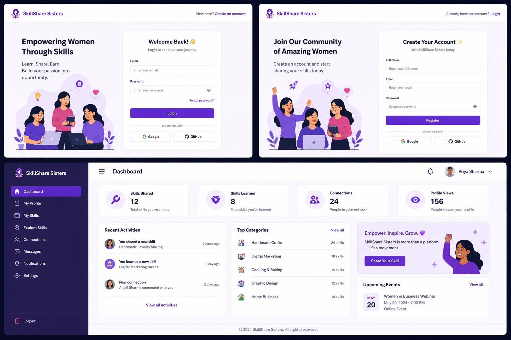

# skillshare-sister
Skillshare Sisters is a full-stack web platform that helps women showcase their home-based skills and service-based work, connect with clients, and collaborate on projects. It provides a modern dashboard, user authentication, and categorized listings for different types of services in a clean startup-style UI.

## 🚀 Setup
## 📸 Project Screenshot

### Backend
cd server
npm install
npm start

### Frontend
cd client
npm install
npm run dev

## 🌐 Deploy
- Backend: Render
- Frontend: Vercel
- DB: MongoDB Atlas

## 💜 Features
- Auth (JWT)
- Skill marketplace
- Modern UI
